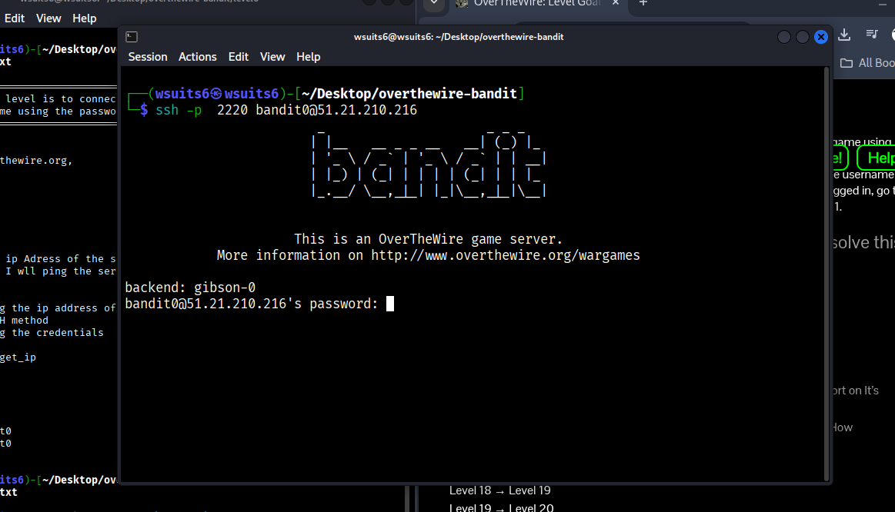
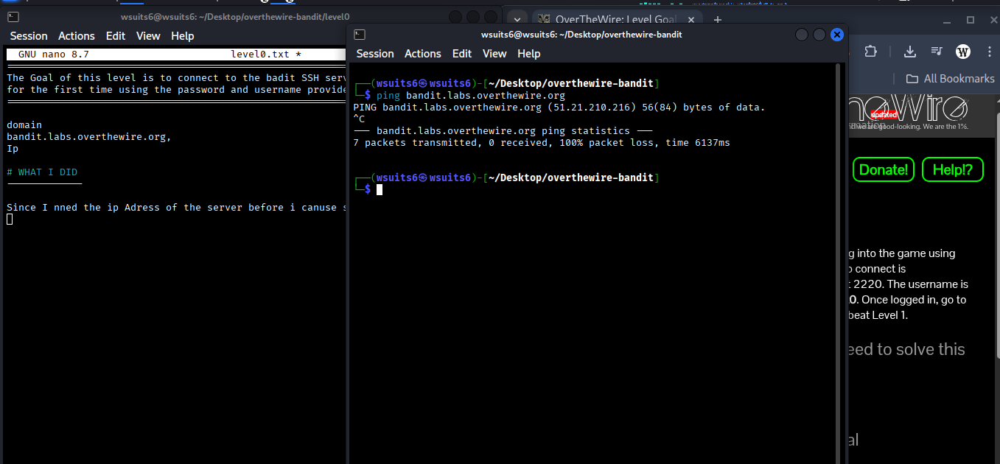
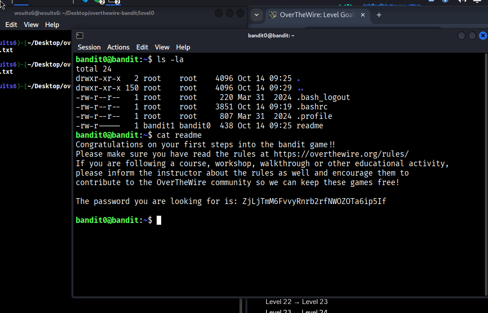
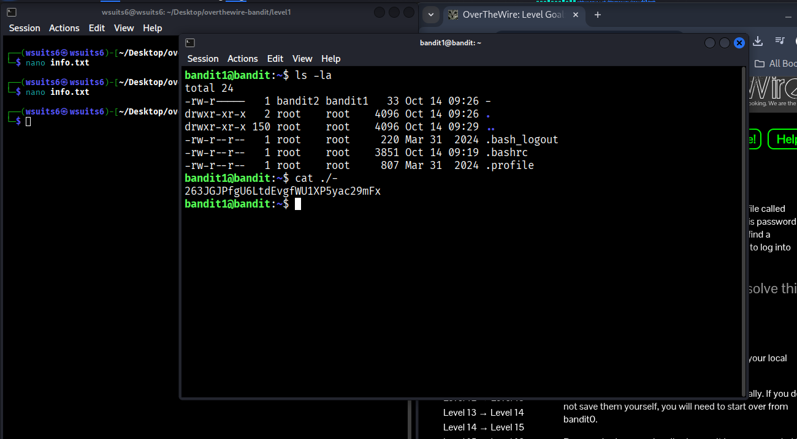
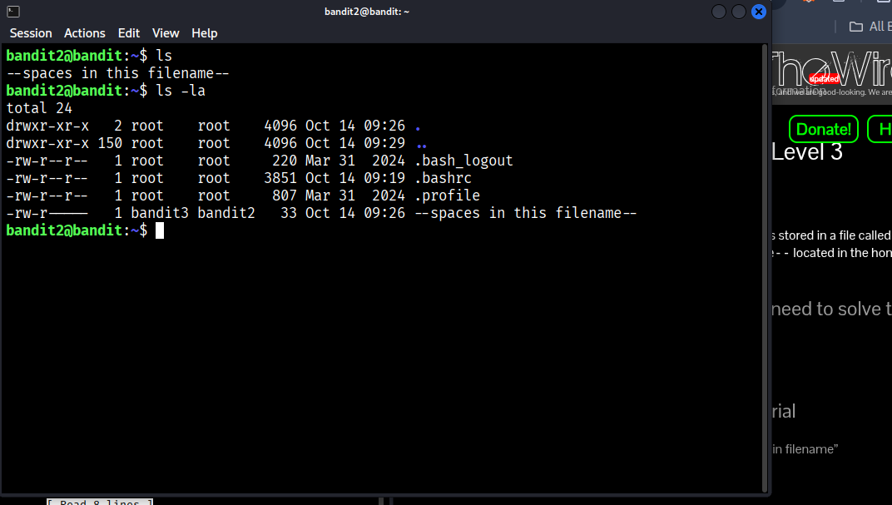
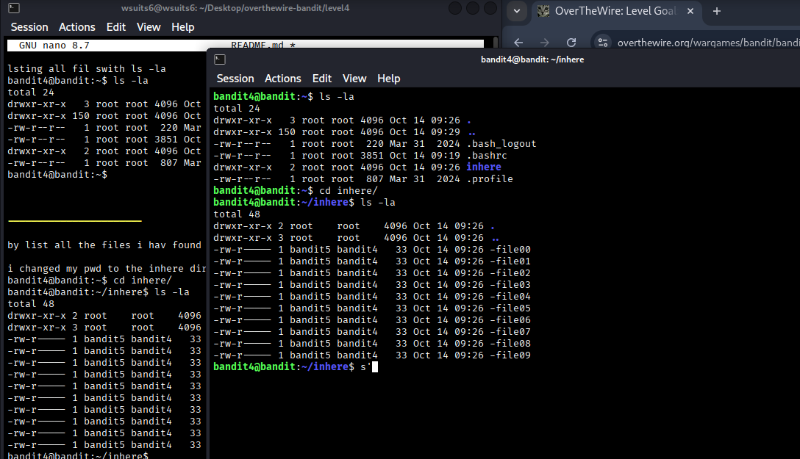
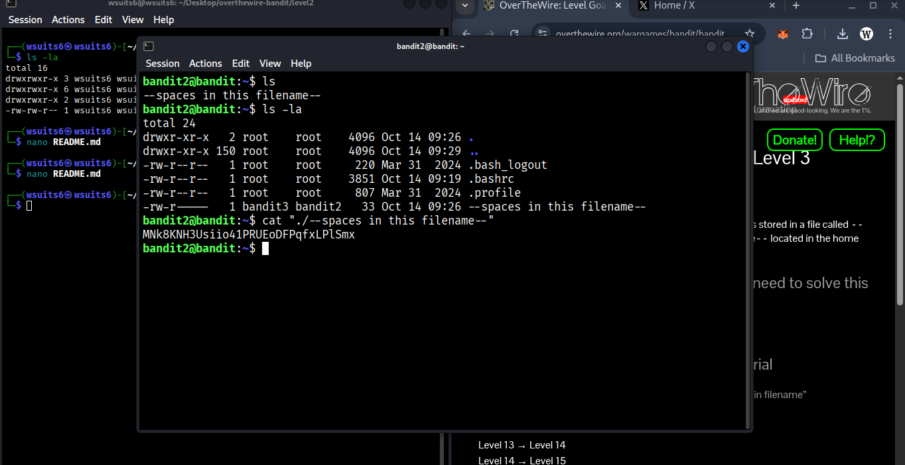
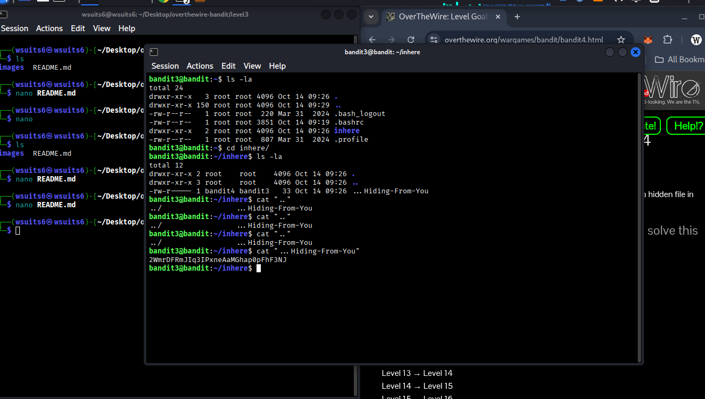

# OverTheWire – Bandit Hacking

**Author:** Wsuits6
**Project:** Bandit Wargame Walkthrough

This repository documents my progress through the **OverTheWire Bandit** wargame. It focuses on learning Linux fundamentals, file systems, permissions, and basic security concepts through hands-on practice.

---

## 📁 Repository Structure

```
├── level0
│   ├── images
│   │   ├── file-listing.png
│   │   ├── flag-found.png
│   │   ├── ping-domain.png
│   │   ├── ssh-connect-fail.png
│   │   └── succesful-login.png
│   └── README.md
├── level1
│   ├── images
│   │   ├── dash-file.png
│   │   ├── flag-found.png
│   │   └── login.png
│   └── README.md
├── level2
│   ├── images
│   │   ├── file-lists.png
│   │   ├── flag-found.png
│   │   └── list-files.png
│   └── README.md
├── level3
│   ├── images
│   │   ├── flag-found.png
│   │   └── login.png
│   └── README.md
├── level4
│   └── README.md
└── README.md
```

---

## 📸 Visual Walkthrough

Below are the images embedded directly from each level folder.

---

### Level 0







---

### Level 1




---

### Level 2





---

### Level 3




---

### Level 4

*(Images will be added once captured.)*

---

## 🧠 Learning Focus

* Linux file systems
* Hidden files and directories
* File permissions
* Command-line navigation
* Security awareness

---

## ✍️ Credit

All documentation and walkthroughs were created by **Wsuits6**.

---

This repository is part of my long-term cybersecurity learning journey.
